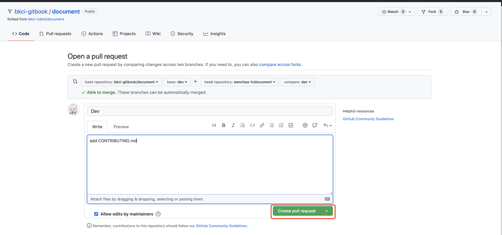

# Contributing to bkci document

我们在编写的过程中，难免会有不完善的地方，希望请大家一起帮助我们持续改进文档的质量，帮助更多的人。

## 方法

在 GitHub 上提 Issue 或 Pull Request，地址为: https://github.com/ci-plugins/document

## 文档规范

1. 文档采用markdown语法编写

2. 图片需统一放置在`.gitbook/assets`下，图片名称不得与已有图片重名

3. 图片名称仅允许大小写字母、数字、`-`、`_`

4. 共建者可以对master分支发起PR，管理员会对PR进行审核

## 文档共建流程

1. Fork repository

首先得拥有github账号，并登录，访问https://github.com/ci-plugins/document，fork到自己的github账号下


2. Clone  

克隆仓库之前，先保证自己fork出来的仓库是否和源仓库保持一致，如果落后于源仓库，可考虑先`Fetch Upstream`，参考步骤4

`git clone https://github.com/xxxx/document`

3. Change & Commit

```
cd /path/to/document
git config user.name "${你的github用户名}"
git config user.mail "${你的邮箱}"
git checkout -b dev origin/dev
echo "add xxx" > xxx.md
git commit -m "add xxx"
```

4. Fetch upstream

在将commit提交到自己的仓库前，查看自己fork出来的代码是否落后于源仓库代码，如果落后，先操作`Fetch upstream`，将源仓库代码的更新下同步到自己仓库。`compare`查看代码差异，`Fetch and merge`将源仓库代码合并到自己仓库


除了在页面上同步最新代码外，还可以在本地仓库里同步最新代码

```
git remote add upstream-repo https://github.com/ci-plugins/document
git pull upstream-repo dev:dev # 如果有冲突无法合并，请自行解决冲突并合并
```

5. Git pull

更新本地代码

```
git pull origin dev:dev # 如果有冲突无法合并，请自行解决冲突并合并
```

6. Git push

```
git push origin dev:dev
```

7. Pull request

发起PR，请求合并到源仓库dev分支，等待管理员审核通过





发起PR，请求合并到源仓库dev分支，等待管理员审核通过