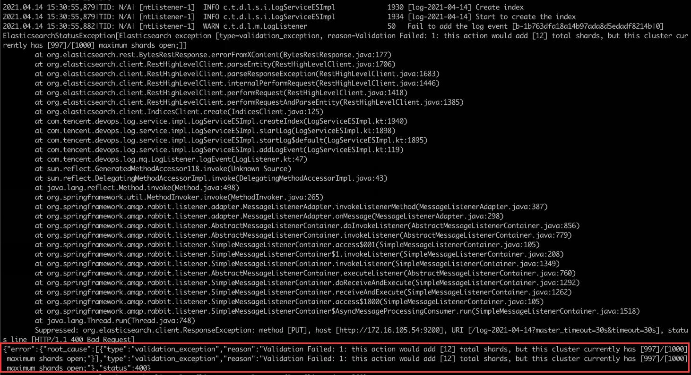

# 流水线执行常见错误

## Q1: 流水线在执行中，unity的构建日志不会实时显示

其原因是「脚本中先执行unity编译构建操作，同时将日志写入文件，但在该操作结束前，不会执行后续的cat命令，导致日志无法实时在web页面上显示」。 针对此场景，可尝试以下解决方式：

```
 nohup $UNITY_PATH -quit -batchmode -projectPath $UNITY_PROJECT_PATH -logFile $UNITY_LOG_PATH -executeMethod CNC.Editor.PackageBuilderMenu.BuildPC "${isMono} ${isDevelop} $UNITY_OUT_PATH" & echo $! > /tmp/unity_${BK_CI_BUILD_ID}.pid unity_main_pid=$(cat /tmp/unity_${BK_CI_BUILD_ID}.pid) tail -f --pid ${unity_main_pid} $UNITY_LOG_PATH
```

---

## Q2:ci不显示日志


查看对应微服务日志 /data/bkce/logs/ci/log/



一个index占了12个shards，超过了es7 设置的shards最大值，这是es7的限制

解决方法：清理一些无用的索引

```
查看目前所有的索引
source /data/install/utils.fc
curl -s -u elastic:$BK_ES7_ADMIN_PASSWORD -X GET http://$BK_ES7_IP:9200/_cat/indices?v
删除索引 # index 是索引名称
curl -s -u elastic:$BK_ES7_ADMIN_PASSWORD -X DELETE http://$BK_ES7_IP:9200/index
# 注意：不能删除 .security-7
```


**另一种可能是用户未安装es7**


## Q3：构建任务中插件长时间卡住

插件默认的超时时间为 900min，若超过超时时间仍未终止，通常是 process 或 project 服务出现了异常。

需进入蓝盾机器，重启服务 

```systemctl status bk-ci-project.service ```

```systemctl status bk-ci-process.service``` 


Q4：渲染测试


---


