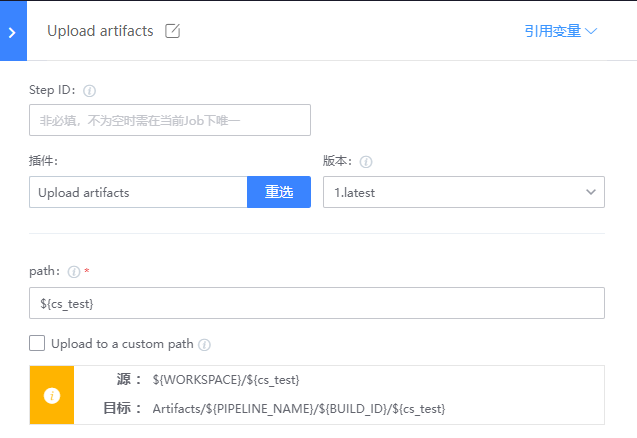

# 通用问题

## Q1: 插件变量值的获取及引用

右上角点击引用变量，然后点右边复制变量，然后粘贴到你需要的地方就可以


自定义的变量如何定义及如何引用，可以参考文档：

[变量定义及引用](https://docs.bkci.net/overview/terminology/variables)

## Q2: 变量的定义及获取

问题一：如何在程序中使用蓝盾的变量

```
# 单行python例子，var为用户在本步骤或者其他步骤定义的变量名，BK_CI_START_USER_NAME是蓝盾的全局变量
python -c "import os; print(os.environ.get('var'))"
python -c "import os; print(os.environ.get('BK_CI_START_USER_NAME'))"

# 如果你知道自己定义的变量名字，也可以在自己的python文件里通过os.envion.get('var')来获取
cat << EOF > test.py
import os
print(os.environ.get('var'))
EOF
python test.py
```

问题二：如何将变量回写到蓝盾

```
# 如果是常量，shell可以使用setEnv，bat可以使用call:setEnv来将变量回写到蓝盾
setEnv "var_name" "var_value" # shell
call:setEnv "var_name" "var_value"  # bat

# 将python脚本输出结果写回蓝盾
var_value=`python script.py` # script.py里需要有print输出，如print("test")
setEnv "var_name" "${var_value}" # var_name="test"

# 把变量写到一个文件中，然后在shell中读取这个文件，然后setEnv
python script.py > env.sh # 假设env.sh里为file_name="test.txt"
source env.sh
setEnv "var_name" "${file_name}"
```

问题三：bat 脚本中调用 python ，将 python 输出回写到蓝盾

````
for /F %%i in('python3 D:\mytest.py') do (set res=%%i)
echo %res%
call:setEnv "var_name" %res%
````

---

## Q3：在插件中使用构建机系统变量

在 batch、shell 中可以直接获取到构建机的系统变量。但其他插件无法直接读取系统变量，因此需要将系统变量转换为蓝盾自定义变量，然后在插件中使用蓝盾变量。

windows 示例：

① 先使用  batch 插件，将系统变量 cs_test 赋值给蓝盾变量

```
call:setEnv "cs_test" "%cs_test%"
```


② 在其他插件中用 ${cs_test} 引用变量




## Q4：如何有条件的执行插件

每个插件都为一个 task，通过高级流程控制，可以定义插件的运行逻辑。

[task 说明](https://docs.bkci.net/overview/terminology/task)


---

# python

## Q1:python如何设置蓝盾变量

python 插件无法直接设置蓝盾变量。只可通过调用shell 或 bat 的方式写入变量。

```
# 将python脚本输出结果写回蓝盾
var_value=`python script.py` # script.py里需要有print输出，如print("test")
setEnv "var_name" "${var_value}" # var_name="test"

# 把变量写到一个文件中，然后在shell中读取这个文件，然后setEnv
python script.py > env.sh # 假设env.sh里为file_name="test.txt"
source env.sh
setEnv "var_name" "${file_name}"
```

---

# Upload artifacts

## Q1、upload后文件去哪了？

upload 后，文件上传到了蓝盾服务器当中。

## Q2、Artifacts 是什么？

Artifacts 是蓝盾服务器的路径。

 /data/bkce/public/ci/artifactory/bk-archive/${项目名称}

## Q3、制品 upload 的绝对路径是什么？

比如项目名称是vincotest，114514.txt实际存放路径就是蓝盾机器上：

/data/bkce/public/ci/artifactory/bk-archive/vincotest/${流水线id}/${构建id}/114514.txt

项目名称、流水线ID、构建ID都可以从流水线url里读取到


---

# batchscript

## Q1：bat 脚本中调用 python ，将 python 输出回写到蓝盾

````
for /F %%i in('python3 D:\mytest.py') do (set res=%%i)
echo %res%
call:setEnv "var_name" %res%
````

---


