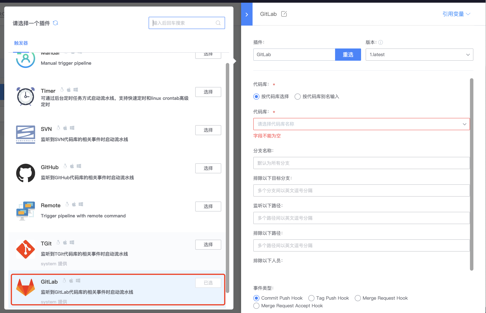
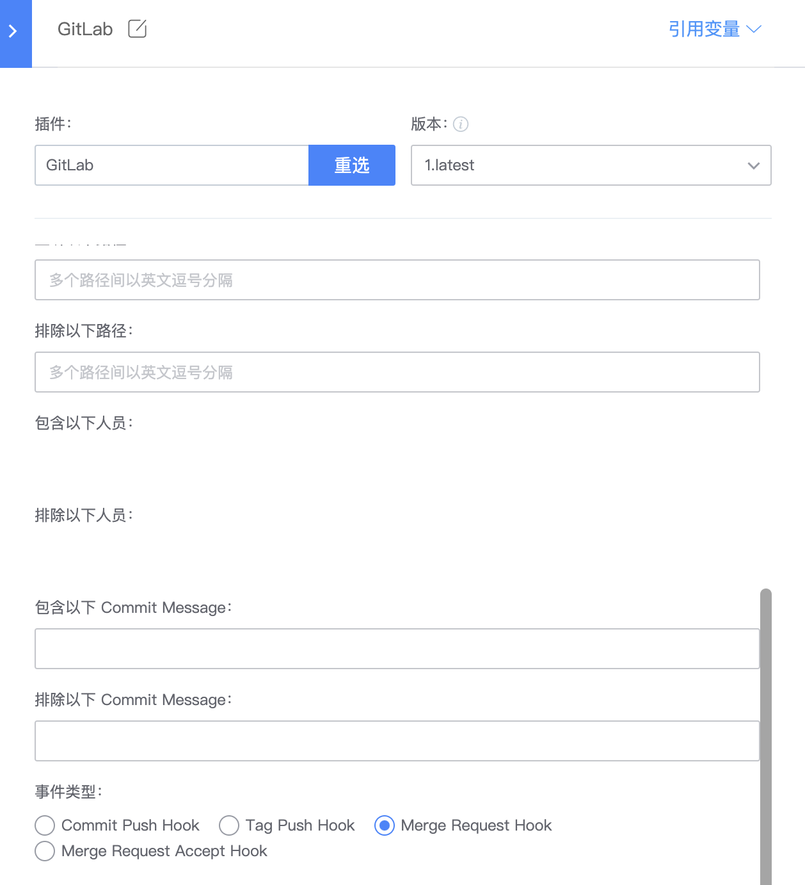

# gitlab代码事件触发流水线
**使用场景：** 当出现代码变更，如代码提交、代码合并时会自动触发流水线

## 触发方式
1. Commit Push Hook 代码提交时触发
2. Tag Push Hook 提交有tag的代码时触发
3. Merge Request Hook 当有代码合并时触发
4. Merge Request Accept Hook 当代码合并后触发

## 参数
不同的触发方式有不同的参数
代码库：公共参数，要监听代码事件的仓库

### Commit Push Hook
1. 分支名称：发生代码事件的分支
2. 排除以下目标分支：被排除的分支即使有代码事件也不会触发流水线
3. 监听以下路径：如果代码变更出现在该路径下，则触发流水线
4. 排除以下路径：如果代码变更出现在该路径下，则不触发流水线
5. 包含以下人员：如果代码变更的作者是该人员，则触发流水线
6. 排除以下人员：如果代码变更的作者是该人员，则不触发流水线
7. 包含以下 Commit Message：如果代码变更的commit信息包含该信息，则触发流水线
8. 排除以下 Commit Message：如果代码变更的commit信息包含该信息，则不触发流水线
   
### Tag Push Hook
1. 分支名称：发生代码事件的分支
2. 监听以下tag：如果提交的代码包含以下tag，则触发流水线
3. 排除以下tag：如果提交的代码包含以下tag，则不触发流水线

### Merge Request Hook
1. 分支名称：merge事件发生的分支，如希望dev分支合并到master分支时触发流水线，则分支名称填写master
2. 排除以下目标分支：merge事件的目标分支为以下分支，则不触发流水线
3. 监听以下源分支：merge事件的源分支为以下分支，则触发流水线
4. 排除以下源分支：merge事件的源分支为以下分支，则不触发流水线
5. 监听以下路径：merge事件目标分支中包含以下路径的代码变更，则触发流水线
6. 排除以下路径：merge事件目标分支中包含以下路径的代码变更，则不触发流水线
7. 包含以下人员：merge事件目标分支中包含以下人员的代码变更，则触发流水线
8. 排除以下人员：merge事件目标分支中包含以下人员的代码变更，则不触发流水线
9. 包含以下 Commit Message：merge事件目标分支中包含以下commit信息，则触发流水线
10. 排除以下 Commit Message：merge事件目标分支中包含以下commit信息，则不触发流水线

### Merge Request Accept Hook
1. 分支名称：merge accept事件发生的分支，如master接收dev分支的合并请求，则分支名称填写master
2. 排除以下目标分支：merge accept事件的目标分支为以下分支，则不触发流水线
3. 监听以下源分支：merge accept事件的源分支为以下分支，则触发流水线
4. 排除以下源分支：merge accept事件的源分支为以下分支，则不触发流水线
5. 监听以下路径：merge accept事件目标分支中包含以下路径的代码变更，则触发流水线
6. 排除以下路径：merge accept事件目标分支中包含以下路径的代码变更，则不触发流水线
7. 包含以下人员：merge accept事件目标分支中包含以下人员的代码变更，则触发流水线
8. 排除以下人员：merge accept事件目标分支中包含以下人员的代码变更，则不触发流水线